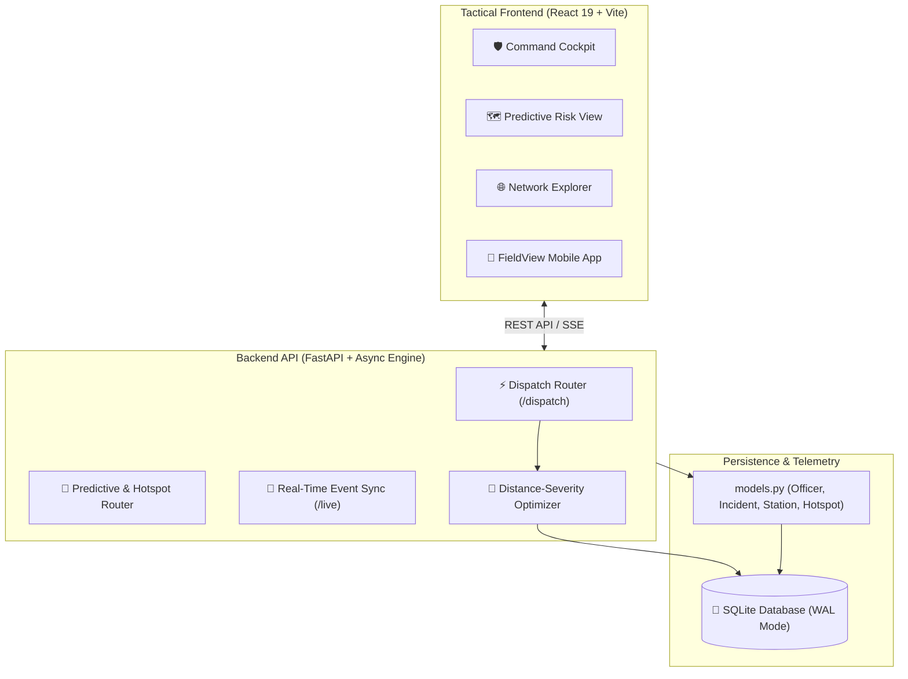

<div align="center">

# 🛡️ SENTINEL

### *AI-Driven Predictive Crime Analytics & Automated Dispatch Optimization Platform*

[](https://fastapi.tiangolo.com/)
[](https://react.dev/)
[](https://tailwindcss.com/)
[](https://www.sqlite.org/)
[](LICENSE)

---

**SENTINEL** is an end-to-end tactical command intelligence system designed for modern law enforcement agencies. It bridges the critical operational gap between **predictive intelligence** and **field logistics**, transforming raw incident telemetry and spatial risk forecasting into real-time, optimal patrol dispatches.

[Key Features](#-key-features) • [Architecture](#-system-architecture) • [Security Audit](#-security--compliance-audit) • [Quickstart](#-quickstart-guide) • [API Specification](#-api-endpoints)

---

</div>

## 🌟 Key Features

### 1. 🔮 Predictive Risk & Hotspot Analytics
- Spatial-temporal forecasting engine mapping crime probability across city districts.
- Dynamic heatmap overlays powered by Leaflet and custom geospatial clustering.
- Real-time anomaly detection identifying sudden surges in incident frequency.

### 2. ⚡ Algorithmic Officer Dispatch Optimizer
- **Distance-Severity Heuristic**: Automatically pairs nearest available patrol units with high-risk hotspots weighted by incident severity.
- **Human-in-the-Loop Control**: Command Staff maintain operational oversight with a single-click *"Confirm Dispatch"* workflow.
- **Real-Time State Tracking**: Microsecond state updates (*Available*, *Dispatched*, *En-Route*, *On-Scene*) leveraging SQLite WAL mode concurrency.

### 3. 🌐 Network & Anomaly Intelligence
- Visual entity link analysis powered by force-directed network graphs.
- Suspect-incident relationship mapping to uncover organized crime rings and repeat hotspot patterns.

### 4. 📡 Multi-Tier Tactical Interfaces
- **Command Cockpit**: High-level situational awareness for district commanders.
- **Predictive Risk View**: Interactive district-level risk mapping.
- **FieldView App**: Streamlined, high-contrast mobile interface for officers receiving real-time dispatch alerts and field acknowledgments.

---

## 🏗️ System Architecture



---

## 🔒 Security & Compliance Audit

A comprehensive DevSecOps security review was conducted across the codebase prior to repository deployment:

| Category | Status | Verification & Safeguards |
| :--- | :---: | :--- |
| **SQL Injection** | `[VERIFIED]` | All database queries strictly utilize **SQLAlchemy ORM** parameterized sessions (`db.query(...)`), completely preventing raw SQL string concatenation vulnerabilities. |
| **Secrets & Keys** | `[VERIFIED]` | Zero hardcoded API keys, JWT secrets, passwords, or cloud tokens exist in the source code. Environment variables and local configuration are strictly isolated. |
| **Data Hygiene** | `[VERIFIED]` | SQLite database binaries, temporary scratch logs, and internal agent telemetry are excluded via `.gitignore` to prevent accidental credential leakage. |
| **Input Sanitization** | `[VERIFIED]` | All backend API endpoints leverage **Pydantic schema validation**, enforcing strict type safety and request payload bounds. |
| **CORS Policy** | `[RECOMMENDED]` | Default CORS allows development origins (`*`). For production deployment, update `main.py` with explicit domain origins. |

---

## 🛠️ Technology Stack

- **Backend**: Python 3.11+, FastAPI, SQLAlchemy, Uvicorn, Pydantic
- **Frontend**: React 19, TypeScript, Vite, Tailwind CSS v4, Lucide React Icons, Leaflet / React-Leaflet, React Force Graph 2D, Recharts
- **Database**: SQLite with Write-Ahead Logging (WAL) concurrency enabled

---

## 🚀 Quickstart Guide

### Prerequisites
- **Python** 3.10+
- **Node.js** 18+ & `npm`

### 1. Backend Setup

```bash
# Navigate to backend directory
cd backend

# Create & activate virtual environment
python -m venv venv
# On Windows:
venv\Scripts\activate
# On Linux/macOS:
source venv/bin/activate

# Install dependencies
pip install -r requirements.txt

# Run the FastAPI server
uvicorn app.main:app --reload --port 8000
```
*The FastAPI server will start at `http://localhost:8000` (API Docs at `http://localhost:8000/docs`).*

### 2. Frontend Setup

```bash
# Open a new terminal and navigate to frontend directory
cd frontend

# Install Node modules
npm install

# Start the Vite development server
npm run dev
```
*The React application will launch at `http://localhost:5173`.*

---

## 📡 API Endpoints Summary

| Method | Endpoint | Description |
| :--- | :--- | :--- |
| `GET` | `/dispatch/officers` | Fetch ranked officer recommendations for a hotspot based on proximity and severity |
| `POST` | `/dispatch/confirm` | Confirm dispatch order and update officer status to `DISPATCHED` |
| `POST` | `/dispatch/acknowledge` | Field officer acknowledgment endpoint broadcasting via SSE/WebSocket |
| `GET` | `/predictive/hotspots` | Fetch spatial-temporal crime hotspots |
| `GET` | `/anomalies` | Retrieve real-time incident frequency anomalies |
| `GET` | `/live/stream` | Server-Sent Events stream for real-time tactical updates |

---

<div align="center">

Developed for the **Karnataka State Police (KSP) Datathon 2026**.

*Operational Command // SENTINEL Platform*

</div>
